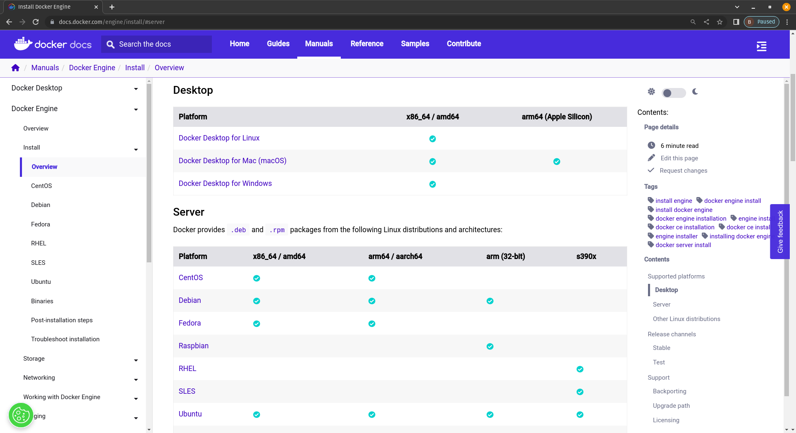
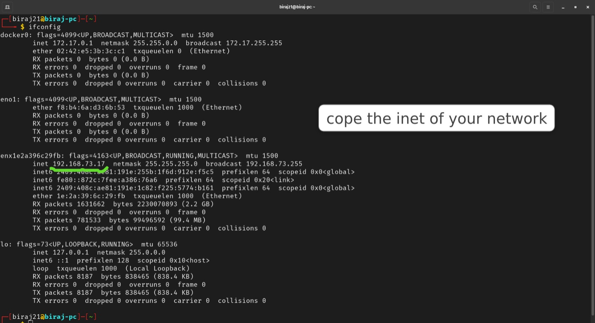
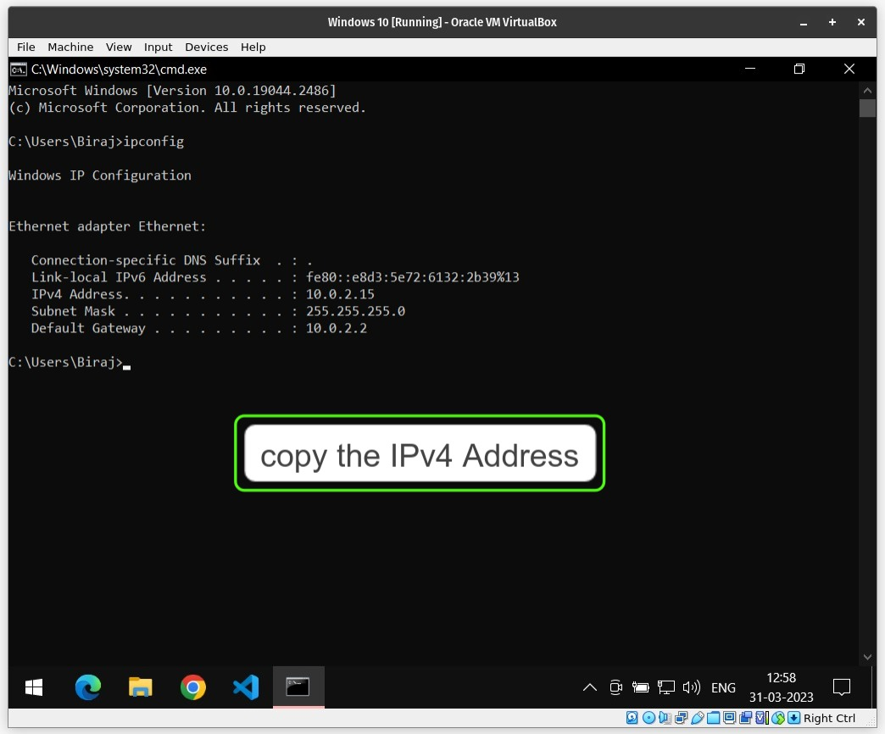
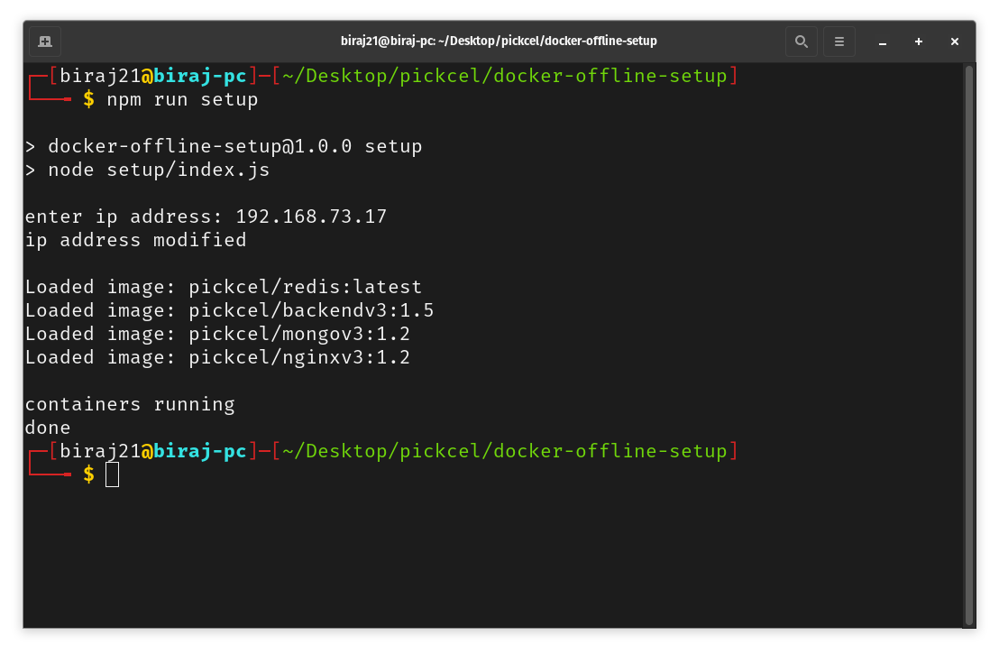

# docker setup offline

- Make sure that [Node.js](https://nodejs.org) & [Docker](https://docs.docker.com/) are installed.

  ```
  $ node --version
  $ docker --version
  ```

  If they are installed, these commands would list the versions without any errors.

- To install them, go to their installation page (links given below) & follow the instructions for your operating system.

  - [Node.js](https://nodejs.org/en/download)
  - [Docker](https://docs.docker.com/engine/install/)

  In case of docker, if your environment is server then look at the [server section](https://docs.docker.com/engine/install/#server) of their installation page & choose your operating system from the given list. You'll get the installation instructions there.

  

- To verify if both of them are installed ot not, you can run `docker -v` & `node -v`.
- If you're using linux, make sure that `ifconfig` is installed as well. You'll need it to get ip address of your local network.
  ```
  $ sudo apt install net-tools
  ```
- Connect your device to the network (wifi or ethernet) in with the screen is also connected.
- Open terminal (linux) or command prompt (windows).
- Now you'll need to know the local ip address of your device. If you're using windows, you can use `ipconfig` command. In linux, you'll have to use `ifconfig` command.

  **Linux example:**

  

  **Windows example:**

  

- Now extract/unzip the docker setup file that you got.
- Using `cd` command, navigate to the extracted/unzipped folder.
- Run the setup command (inside the extracted folder ofcourse).

  ```
  $ npm run setup
  ```

  **Linux example:**
  

- This should start your signage server. You can verify this by opening your browser & entering a URL like `http://<ip-address>:8080`

  
