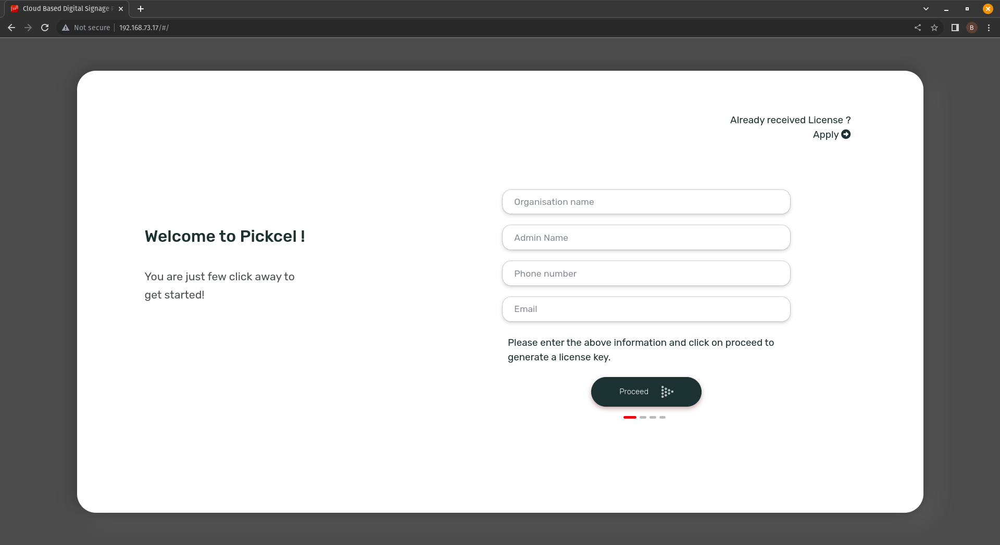

# docker setup offline

- Make sure that [Docker](https://www.docker.com/) & [Node.js](https://nodejs.org) are installed.
- To verify if both of them are installed ot not, you can run `docker -v` & `node -v`.
- If you're using linux, make sure that `ifconfig` is there as you'll need it to get ip address of your local network.
  ```
  $ sudo apt install net-tools
  ```
- Connect your device to a network (wifi or ethernet).
- Open terminal (linux) or command prompt (windows).
- Now you'll need to know the local ip address of your device. If you're using windows, you can use `ipconfig` command. In linux, you'll have to use `ifconfig` command.

  **Linux example:**

  

  **Windows example:**

  

- Now extract/unzip the docker setup file that you got.
- Using `cd` command, navigate to the extracted/unzipped folder.
- Run the setup command (inside the extracted folder ofcourse).

  ```
  $ npm run setup
  ```

  **Linux example:**
  

- This should start your signage server. You can verify this by opening your browser, and entering a URL like `http://<ip-address>:8080`

  
